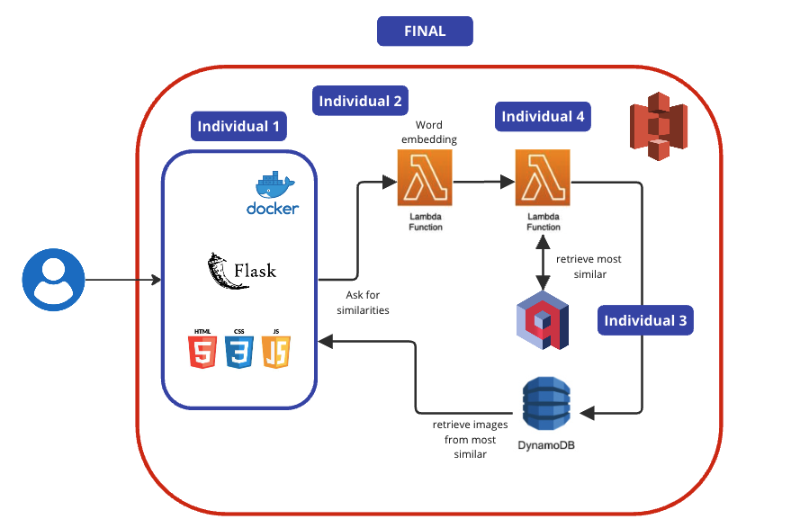
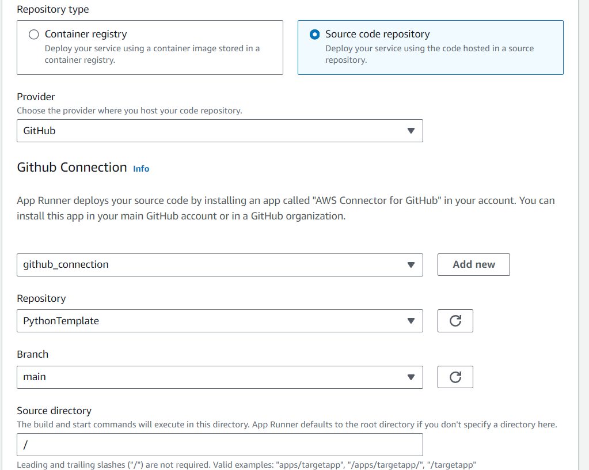
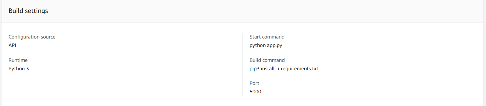
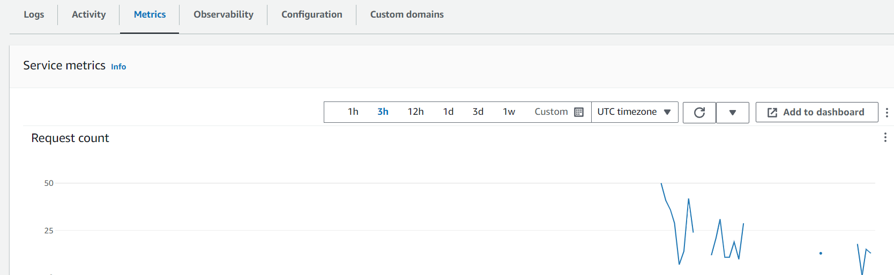
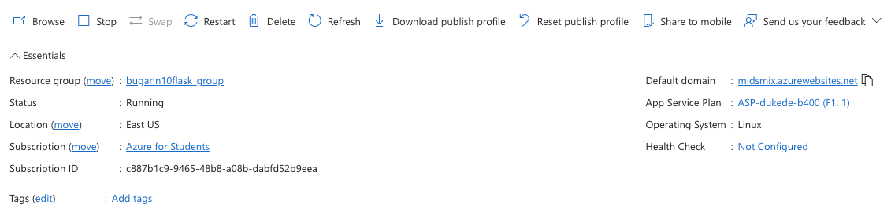

### Demo video

 

 

# Mix and Cocktail recommendation Engine 🍷🍸🍹

# Motivation

Our moto is the impact we can make in alleviating choice overload. This phenomenon, characterized by the overwhelming stress and indecision caused by an abundance of options, is a challenge many face daily. By developing a recommendation engine, we aim to empower individuals with personalized suggestions, reducing the cognitive load associated with decision-making and increasing satisfaction with chosen options. Let's drink and think in the conversation not on what to drink!

# Project Structure

This is the broad structure of the project and how we visualize is going to be merging all projects:

## Personal Cocktail Recommendation Engine
The first half of this project was to create a home-brewed cocktail recommendation engine. The engine was built using a dataset of cocktail recipes and ingredients. Using Pinecone, we were able to create a vector representation of each cocktail recipe and use cosine similarity to recommend similar cocktails based on user input. 

## Hugging Face Cocktail Recommendation Engine
The second half of this project was to create a cocktail recommendation engine using Hugging Face's model hub. For the same, we used a pre-trained model from Hugging Face's model hub to generate cocktail recommendations based on user input, namely, google-flan-large. 

# Deployment

For deployment we utilized AWS Apprunner. AWS Apprunner provides the standard offerings as a cloud container manager that you would expect. What is also provides is the ability to deploy directly from an application's repository. This is a huge benefit and quality of life improvement, particularly when deploying web applications. Where the traditional CI/CD Pipeline would involve utilizing a Dockerfile in combination with github actions to orchestrate a docker image build on push to a deployment branch, then pushing that image to a container registry (for AWS Apprunner that would be AWS Elastic Container Registry) after managing appropriate IAM permissions and secrets. From there the AWS ECR image can be pulled into AWS Apprunner and served as a deployed web application. This is fine, can be automated, and generally (once established) happens in the background without much through. But establishing this pipeline can be problematic and extend development times. What AWS Apprunner allows is for deployment directly from a code repositroy through a github connection:

This allows you to select the repository, branch, and application directory location for Apprunner to build a container image and serve your application. Once complete, Apprunner takes build and start commands, builds a docker image based on the specified runtime, and deploys the application. 

The key value add here is that Dockerfiles are largely boilerplate code and Apprunner lets you enter the idiosyncratic docker statements that change from project to project while saving you the developer time of generating the rest, building the image, and deploying the image. Developers retain all the same control they would have had with a Dockerfile while outsourcing all the deployment steps. Moreover, should more fine grained control be needed, Apprunner supports deployment with an apprunner.yaml file in the application directory which can be used in lieu of many CI/CD tools to programatically describe an automated deployment through infrastructure as code.

Apprunner also give you built in multi-tiered logging (Apprunner, deployment, and application) but also instrumentation and telemetry in the form of robust metrics:

Apprunner provides compelling functionality and quality of life for this use case and many others.

